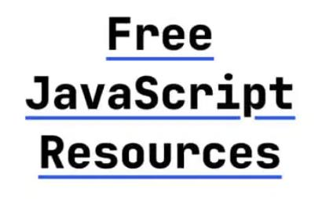

  

This repository contains free resources to learn Javascript (Including NodeJs, JS handson, Basic Algorithms) and prepare for interviews.

Join my free [Tech Blog](https://parveenpal.hashnode.dev) and get a **FREE Resources on Javscript** in your inbox.

## 📌 Javscript Basics
- [Difference between .js, .cjs, .mjs file extension](https://parveenpal.hashnode.dev/what-is-the-difference-between-js-cjs-and-mjs-file-extension)
- [Essentials security Headers in API](https://parveenpal.hashnode.dev/essential-s)

## 📌 Javascript Algorithm/ Programs
- [Arrays](src/Arrays/README.md)
- [String](src/String/README.md)